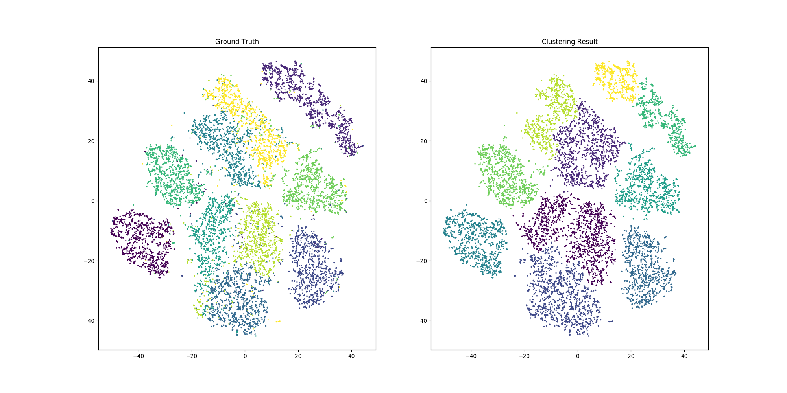
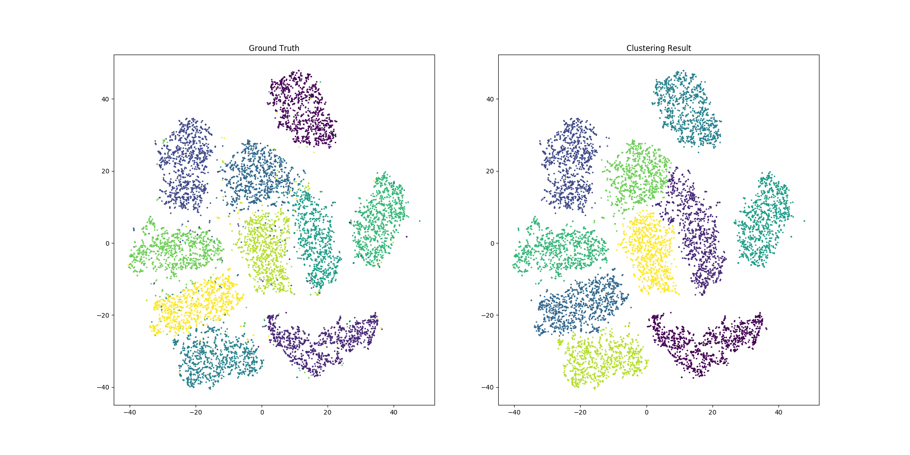

# Convolutional Autoencoder
## This is a toy unsupervised method on MNIST using convolutional autoencoder:
1. A convolutional autoencoder is trained on MNIST training set.
2. Features are extracted from the middle layer of the autoencoder.
3. Testing set features are clustered using T-SNE and hierarchical clustering.
Result: 93% accuracy on testing set.

## Visualizations:
After the first epoch:

After the last epoch:

